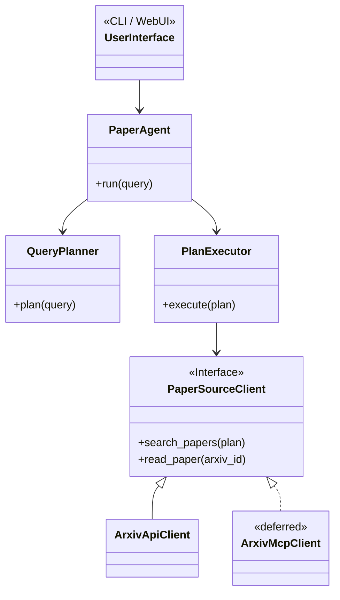

---
js:
  - https://cdn.jsdelivr.net/npm/mermaid/dist/mermaid.min.js
---

# SummX

> By Andrew Maner, Ph.D. | November 2025

**SummX** is a local, agent-based AI tool designed to search, retrieve, and summarize academic papers from online sources like arXiv.

It uses a multi-step, agentic pipeline to convert natural language queries into structured, summarized research findings.

## Core Features

-   **Natural Language Queries**: Ask for papers in plain English (e.g., "most recent papers on hypergraphs").
-   **Agentic Pipeline**: A `QueryPlanner` converts your request into a structured `SearchPlan`, which a `PlanExecutor` then executes.
-   **Pluggable Backends**:
    -   **LLM Providers**: Supports multiple LLM backends (OpenAI, Groq) for planning and summarization.
    -   **Paper Sources**: A `PaperSourceClient` interface allows for multiple paper backends. The primary backend is a direct client for the arXiv API. An MCP-based client is planned for future development but is not currently implemented.
-   **CLI & Web UI**: Interact with SummX through a command-line interface or a Streamlit-based web UI.
-   **Local-First**: Designed for local execution and caching of results.

## Architecture

SummX follows a modular, API-first design. The core agent logic is decoupled from the data sources, allowing for greater stability and extensibility.



This architecture ensures that the core functionality does not depend on the availability of any single external service (like an MCP server) and can be easily extended to support new paper sources in the future.

## Quick Start

### 1. Installation

Clone the repository and install the dependencies in a virtual environment:

```bash
# Create and activate a virtual environment
python -m venv .venv
source .venv/bin/activate

# Install the package in editable mode with dev dependencies
pip install -e ".[dev]"
```

### 2. Configuration

SummX is configured via environment variables, which can be placed in a `.env` file in the project root.

#### Required

- `OPENAI_API_KEY`: Your API key for OpenAI.
- `GROQ_API_KEY`: Your API key for Groq.

```
# .env
OPENAI_API_KEY="your-openai-api-key"
GROQ_API_KEY="your-groq-api-key"
```

#### Optional

- `PAPER_SOURCE`: The paper source to use. Defaults to `api`. Can be set to `mcp` for the experimental MCP backend.
- `PLANNER_PROVIDER`: The LLM provider for the planner. Defaults to `openai`.
- `PLANNER_MODEL`: The specific model for the planner. Defaults to `gpt-4o-mini`.
- `SUMMARIZER_PROVIDER`: The LLM provider for the summarizer. Defaults to `groq`.
- `SUMMARIZER_MODEL`: The specific model for the summarizer. Defaults to `llama-3.1-8b-instant`.

### 3. Usage

#### Command-Line Interface (CLI)

Run a query from your terminal:

```bash
summx query "five most recent papers on hypergraphs"
```

#### Web UI

Launch the Streamlit web interface:

```bash
summx ui
```

This will open the UI in your web browser, where you can interactively search for and summarize papers.

---

# Legal & Compliance Note (arXiv)

SummX interacts with arXiv only by:

* querying publicly available metadata,
* linking to arXiv’s own public PDF URLs,
* optionally caching PDFs **locally on the user’s machine** for private use.

This usage pattern is designed to respect **arXiv’s Terms of Use** and **API policies**.

---

## ✔ What SummX *is allowed* to do

* **Link to official arXiv PDF URLs**
  SummX may display download links such as:
  `https://arxiv.org/pdf/<arxiv_id>.pdf`
  This is equivalent to clicking “Download PDF” on the arXiv website.

* **Download PDFs locally for personal use**
  Users may download PDFs for offline reading.
  Local files remain on the user’s machine and are **not redistributed**.

* **Query metadata from arXiv’s public API**
  SummX uses the same public API that arXiv provides for researchers.

These actions are explicitly allowed under arXiv’s distribution model and metadata access policy.

---

## ✖ What SummX *must not* do

To comply with arXiv’s API Terms and licensing restrictions, SummX does **not**:

* **Re-host arXiv PDFs or source files**
  SummX never serves PDFs from its own servers or redistributes them.
  arXiv’s Terms forbid storing/serving e-prints as part of a service.

* **Provide bulk downloading at scale for redistribution**
  SummX is intended for interactive research use, not mass harvesting.

* **Modify, republish, or sublicense arXiv papers**
  arXiv content may have varying author-selected licenses; users are responsible for respecting those.

---

## ✔ Why SummX’s approach is compliant

SummX is a **local research tool**, not a hosting or redistribution service.

* Users click links that go directly to arXiv’s own infrastructure.
* Any downloaded files stay local and private.
* No paper content is stored or served by SummX to other users.
* SummX does not perform or offer bulk redistribution of arXiv content.

This model conforms to arXiv’s guidance encouraging access through direct links and personal use of downloaded papers.

---

## 📌 Summary

**Safe:**

* Linking to arXiv PDFs
* Local caching for private reading
* Searching metadata
* Summaries generated by the user’s LLM provider

**Not allowed:**

* Re-hosting PDFs
* Serving PDFs or metadata as an online service
* Bulk redistribution

---
