---
js:
  - https://cdn.jsdelivr.net/npm/mermaid/dist/mermaid.min.js
---

## 📘 `README.md` – Part 1

### SummX: Architecture & Project Structure

# SummX

**SummX** is a local, agent-based AI tool designed to search, retrieve, and summarize
academic papers (starting with arXiv) using an MCP-based tool interface and 
pluggable LLM backends.

It supports:
- Natural language paper queries
- Multi-step agent reasoning
- arXiv integration via MCP servers
- Multiple LLM providers (OpenAI, Groq, others)
- CLI + Web UI interfaces
- Local caching and local-first workflows

SummX is designed to be easily adoptable by researchers and extensible to other
public scientific repositories.

---

## 1. High-Level Architecture

SummX follows a layered architecture:

1. **UI Layer**
   - Streamlit web UI
   - CLI interface (`summx` command)

2. **Agent Layer**
   - A planner LLM converts user queries into structured plans.
   - An executor executes those plans using MCP + summarization models.

3. **LLM Abstraction Layer**
   - Unified interface for OpenAI, Groq, and other LLM backends.

4. **MCP Access Layer**
   - Handles interaction with arXiv via an MCP server.

5. **Models + Data Layer**
   - Internal representations of papers, plans, and outputs.

---

## 2. Top-Level Repository Structure

```text
summx/
├── pyproject.toml      # Build, dependency, and CLI configuration
├── README.md           # Project documentation (this file)
├── .env.example        # Example environment variables
├── .gitignore          # Git ignore rules
├── src/
│   └── summx/          # Main Python package
└── tests/              # Unit and integration tests
```

---

## 3. Root File Purposes

### 📄 `pyproject.toml`

Defines project metadata, dependencies, Python version, dev tools, and entry points.

Key responsibilities:

* Python version compatibility
* Dependency management
* CLI entry point (`summx`)
* Dev tooling config (black, ruff, pytest)

---

### 📄 `README.md`

Primary documentation file.

Contains:

* Project goals
* Architecture documentation
* Usage instructions
* Developer structure guide
* UML class diagrams

---

### 📄 `.env.example`

Template for environment variables.

Example contents:

```bash
OPENAI_API_KEY=
GROQ_API_KEY=
MCP_ARXIV_COMMAND=uv tool run arxiv-mcp-server
MCP_ARXIV_STORAGE_PATH=~/.summx/papers
```

---

### 📄 `.gitignore`

Ensures things like these never get committed:

* `.venv/`
* `__pycache__/`
* `.env`
* `.summx/` cache
* Build artifacts

---

## 4. System-Wide UML Architecture

Here’s a top-level UML class diagram showing how the major components relate:

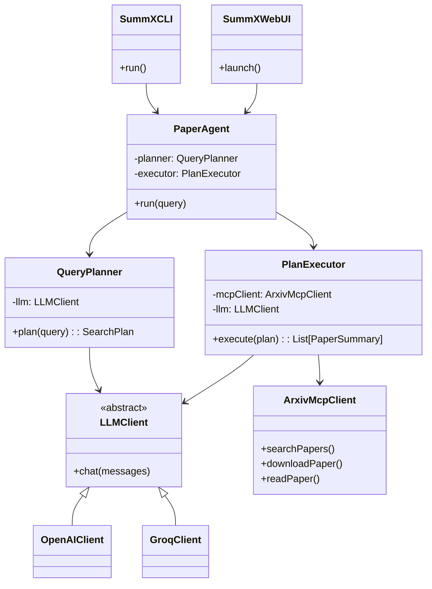


---

## 5. Project Philosophy

SummX is intentionally structured for:

* **Extensibility**
  Add new paper sources via new MCP clients.
* **Backend agnosticism**
  Any LLM backend configurable via abstraction layer.
* **Local-first usage**
  No cloud dependency except LLM providers.
* **Academic adoption**
  Simple install, minimal friction, reproducibility-friendly.

---

## 📘 `README.md` – Part 2

### The `src/summx/` Package Architecture

## 6. The `src/summx/` Package

This directory contains the full core implementation of SummX:
- Agent logic
- LLM abstraction
- MCP integration
- CLI
- UI
- Domain models
- Configuration & utilities

Structure:

```text
src/summx/
├── **init**.py
├── config.py
├── prompts.py
├── utils.py
├── models/
├── llm/
├── mcp/
├── agent/
├── cli/
└── ui/
```

Each submodule is described below.

---

## 6.1 `__init__.py`

Purpose:
- Exposes the public API of the SummX package.
- Defines package version and high-level imports for users.

Example responsibilities:
- Expose `SummX`
- Optional: expose convenience factory methods.

Potential contents:
```python
__version__ = "0.1.0"

from summx.agent.executor import PaperAgent
```

---

## 6.2 `config.py`

Purpose:
Central configuration hub.

Responsibilities:

* Load environment variables
* Define default models and providers
* Handle MCP server configuration
* Centralize filesystem paths

### Key Responsibilities

| Config                   | Purpose                     |
| ------------------------ | --------------------------- |
| `OPENAI_API_KEY`         | OpenAI backend config       |
| `GROQ_API_KEY`           | Groq backend config         |
| `MCP_ARXIV_COMMAND`      | How to run arxiv MCP server |
| `MCP_ARXIV_STORAGE_PATH` | Where PDFs are cached       |
| Default LLM models       | Planner + summarizer        |

---

### UML – `SummXConfig`

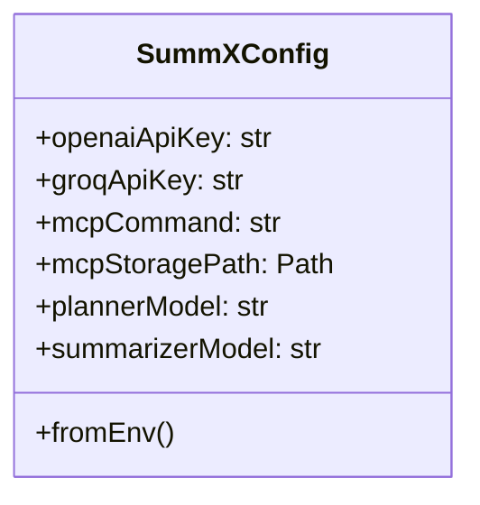

---

## 6.3 `prompts.py`

Purpose:
Central repository for all prompt templates.

Design goals:

* All LLM prompts live in one file.
* Easy to version and iterate.

### Responsibilities

| Prompt                               | Used by        |
| ------------------------------------ | -------------- |
| Query Planner                        | `QueryPlanner` |
| Paper Summarizer                     | `PlanExecutor` |
| Possibly future RAG / advanced flows |                |

---

### UML – Prompt Layout

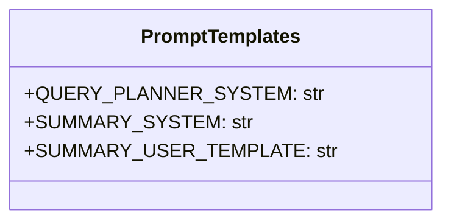

---

## 6.4 `utils.py`

Purpose:
Reusable helpers that don’t logically belong anywhere else.

Examples:

* arXiv ID parsing from URLs
* PDF URL builder
* Token chunking utilities
* Text truncation helpers

### UML – `Utils`

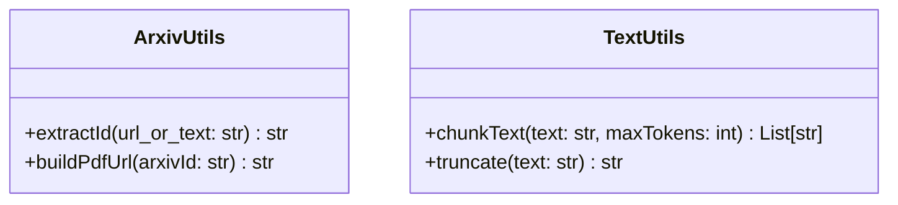

---

## 6.5 `models/` – Domain Models

Purpose:

* Define internal data structures (pure data, no logic)
* Act as neutral interchange between modules

We will deep-dive this next, but at a glance:

Models include:

* `PaperMeta`
* `SearchPlan`
* `SummarizationConfig`

---

## 6.6 `llm/` – LLM Backend Abstraction

Purpose:
Allow SummX to talk to multiple AI backends without changing core logic.

Key idea:

> Everything below sees only `LLMClient`, never the concrete provider.

Structure:

```text
llm/
├── base.py
├── openai_client.py
└── groq_client.py
```

---

### UML – LLM Layer

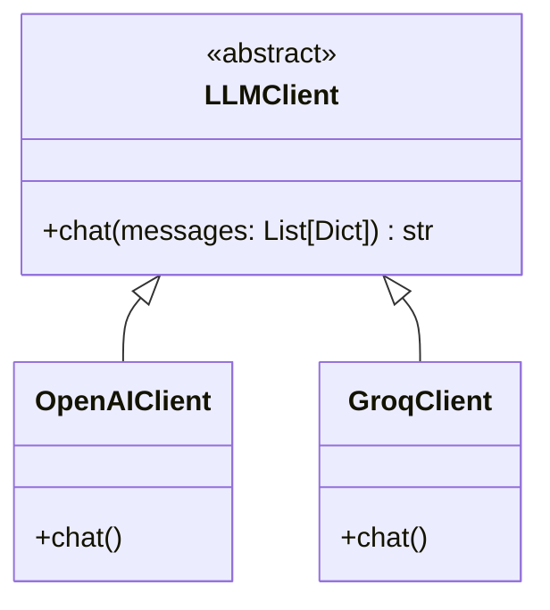

---

## 6.7 `mcp/` – MCP Interface Layer

Purpose:
Encapsulates all interactions with MCP servers.

Structure:

```text
mcp/
├── session.py
└── arxiv_client.py
```

Responsibilities:

* Spawning MCP server processes
* Managing MCP communication
* Translating raw MCP output into SummX models

---

### UML – MCP Layer

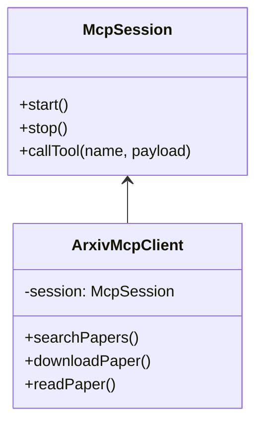

---

## 6.8 `agent/` – Agent Logic

Purpose:
This is the intelligence core:
it takes a vague user input → produces structured plans → executes them.

Structure:

```text
agent/
├── planner.py
└── executor.py
```

Breakdown:

* `planner.py`: LLM converts ambiguous query → structured plan
* `executor.py`: Deterministic execution of the plan

---

### UML – Agent Layer

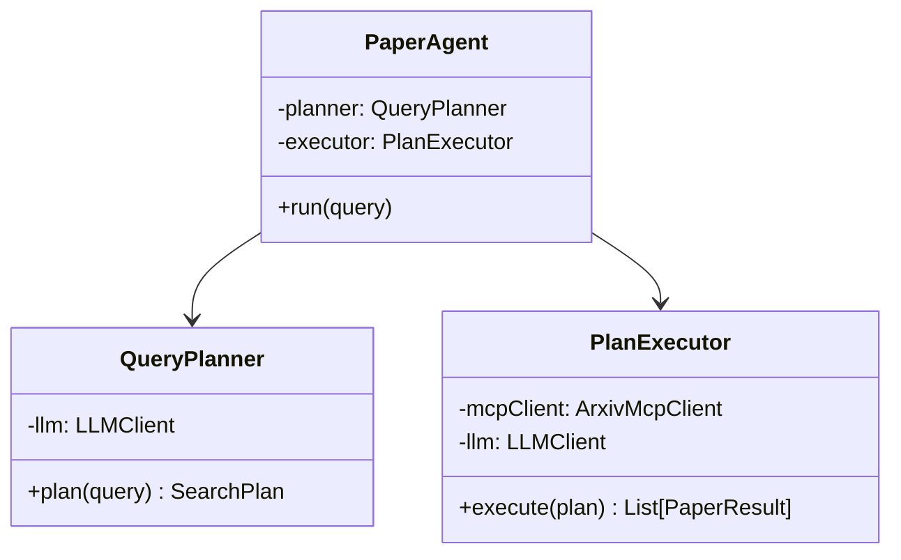

---

## 6.9 `cli/` – Command Line Interface

Purpose:
Thin CLI wrapper around the `PaperAgent`.

Structure:

```text
cli/
└── main.py
```

Responsible for:

* Parsing CLI args
* Building agent
* Invoking agent
* Formatting output

---

### UML – CLI Layer

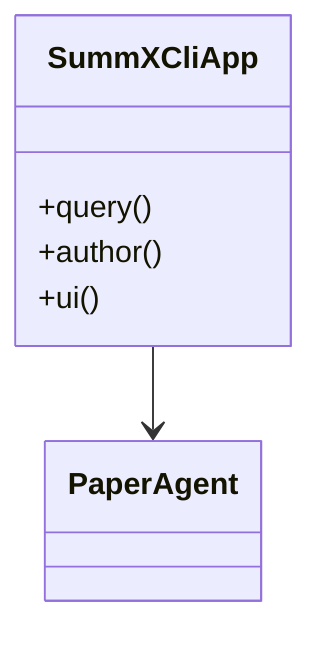


---

## 6.10 `ui/` – Streamlit Web UI

Purpose:
Provide a friendly interface for non-CLI users.

Structure:

```text
ui/
└── streamlit_app.py
```

Responsibilities:

* Simple front-end
* Show summaries
* Provide PDF download links
* Select LLM providers

---

### UML – UI Layer

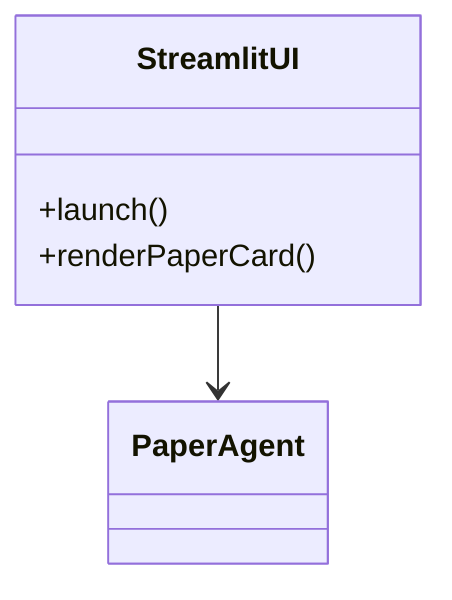

---

## 7. `src/summx/models/` – Domain Models

The `models` package defines all core data structures used across SummX.
These are **pure data objects** (no external side effects) and form the
contract between:

- the **agent** (planner + executor),
- the **MCP layer**,
- the **LLM layer**, and
- the **UI / CLI**.

Keeping these models clean and stable makes it easy to evolve the rest of
the system without breaking everything.

### 7.1 Structure

```text
src/summx/models/
├── __init__.py
├── paper.py
└── plan.py
```

---

### 7.2 `models/__init__.py`

**Purpose**

* Provide a single import surface for commonly used models.
* Avoid deep import paths like `from summx.models.paper import PaperMeta`.

**Typical usage**

```python
from summx.models import PaperMeta, PaperResult, SearchPlan
```

**Responsibilities**

* Re-export:

  * `PaperMeta`, `PaperContentSections`, `PaperSummary`, `PaperResult`
  * `SearchPlan`, `SummarizationConfig`, `SearchFilters`

No classes are *defined* here; it’s purely an aggregator.

---

### 7.3 `models/paper.py`

**Purpose**

Encapsulate everything related to the **paper domain**:

* Metadata returned from arXiv / MCP
* Content sections extracted from PDFs
* Summaries produced by LLMs
* A combined “result” object the UI/CLI can render

**Classes to define**

1. `PaperMeta`
2. `PaperContentSections`
3. `PaperSummary`
4. `PaperResult`

#### 7.3.1 `PaperMeta`

Represents metadata for a single paper as returned by the MCP layer.

**Fields (suggested)**

* `arxiv_id: str` – canonical arXiv identifier (e.g. `"2403.01234"`)
* `title: str`
* `authors: list[str]`
* `categories: list[str]` – arXiv categories / subjects
* `published: str` – ISO8601 date string (or `datetime` if you prefer)
* `abstract: str | None` – optional pre-parsed abstract
* `pdf_url: str | None` – direct PDF link, if known
* `local_pdf_path: str | None` – local cached PDF path, if known

#### 7.3.2 `PaperContentSections`

Represents the extracted textual content of a paper, optionally split
into semantic sections.

**Fields**

* `full_text: str` – full concatenated text (fallback)
* `abstract: str | None`
* `introduction: str | None`
* `methods: str | None`
* `results: str | None`
* `conclusion: str | None`
* `other_sections: dict[str, str]` – for anything else (`"related work"`, etc.)

#### 7.3.3 `PaperSummary`

Represents the LLM-produced summary of a paper.

**Fields**

* `tldr: list[str]` – 3–5 bullet points
* `problem: str`
* `method: str`
* `results: str`
* `limitations: str`
* `future_work: str`
* `raw_markdown: str` – the original markdown response from the LLM (for UI rendering / debugging)

> You can keep both structured fields **and** the raw markdown;
> the UI can use whichever is more convenient.

#### 7.3.4 `PaperResult`

Convenience wrapper combining everything the UI/CLI needs for a single paper.

**Fields**

* `meta: PaperMeta`
* `content: PaperContentSections | None` – may be omitted for “metadata only” operations
* `summary: PaperSummary | None`
* `plan_tags: list[str]` – optional tags, e.g. why this paper was selected, intent, etc.

---

#### 7.3.5 UML – Paper Models

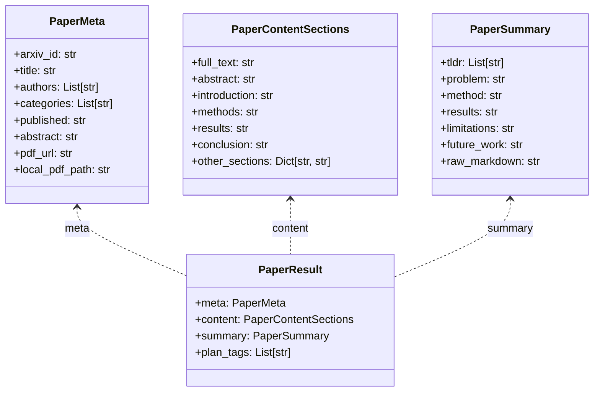

---

### 7.4 `models/plan.py`

**Purpose**

Define the internal representation of what the **agent plans to do**
for a given user query.

The typical flow is:

> User query → `QueryPlanner` → **`SearchPlan`** → `PlanExecutor` → MCP + LLM

**Types / Classes to define**

1. `SortType` (Literal / Enum)
2. `DepthType` (Literal / Enum)
3. `SummarizationConfig`
4. `SearchFilters`
5. `SearchPlan`

#### 7.4.1 `SortType` and `DepthType`

These can be `typing.Literal` types or small Enums, e.g.:

* `SortType = Literal["most_recent", "relevance"]`
* `DepthType = Literal["abstract", "abstract+intro+conclusion", "full"]`

They constrain the values that the planner and executor are allowed to pass around.

#### 7.4.2 `SummarizationConfig`

Controls how (and whether) the summarization step is run.

**Fields**

* `enabled: bool`
* `depth: DepthType` – level of detail
* `max_tokens: int | None` – optional cap for LLM calls

#### 7.4.3 `SearchFilters`

Represents user-intent filters extracted from the query.

**Fields**

* `topic: str | None` – e.g. `"hyper graphs"`
* `author: str | None` – e.g. `"Laszlo Lovasz"`
* `date_from: str | None` – ISO8601 or simple `"YYYY-MM-DD"`
* `date_to: str | None`

You can start minimal (topic + author) and add date fields later if you wish.

#### 7.4.4 `SearchPlan`

The main “plan” object used internally by the agent.

**Fields**

* `intent: str` – currently `"search_papers"` (future: `"summarize_specific_id"`, etc.)
* `source: str` – e.g. `"arxiv"`
* `filters: SearchFilters`
* `sort: SortType`
* `limit: int`
* `summarization: SummarizationConfig`
* `raw_query: str` – original user query (for traceability / debugging)

This is what `QueryPlanner.plan()` returns and what `PlanExecutor.execute()` consumes.

---

#### 7.4.5 UML – Plan Models

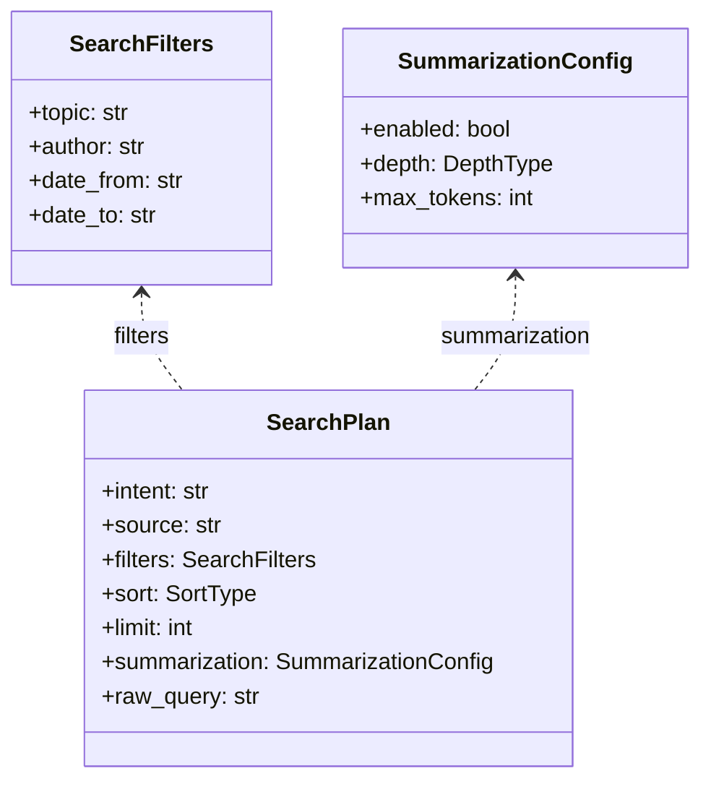

---

### 7.5 How These Models Are Used End-to-End

* The **planner**:

  * takes `raw_query: str`
  * returns `SearchPlan`

* The **executor**:

  * takes `SearchPlan`
  * calls `ArxivMcpClient` → gets `PaperMeta` + `PaperContentSections`
  * calls summarizer LLM → gets `PaperSummary`
  * wraps it all into `PaperResult` list

* The **CLI/Web UI**:

  * consumes `List[PaperResult]`
  * renders metadata, summary, and download links

Because these models don’t depend on any external systems, they’re
easy to test and stable to version.

---

## 8. `src/summx/mcp/` – MCP Integration Layer

The `mcp` package encapsulates all interaction with **Model Context Protocol (MCP)**
servers, starting with an arXiv MCP server.

Goals:

- Hide all MCP protocol / process details behind a clean Python interface.
- Provide **source-specific clients** (e.g., `ArxivMcpClient`) that return
  **SummX models** (`PaperMeta`, `PaperContentSections`, etc.).
- Make it easy to add other MCP-backed sources later (PubMed, Semantic Scholar, etc.).

### 8.1 Structure

```text
src/summx/mcp/
├── __init__.py
├── session.py
└── arxiv_client.py
```

---

### 8.2 `mcp/__init__.py`

**Purpose**

* Provide convenient imports for MCP-related classes.
* Avoid deeply nested imports in other modules.

**Typical usage**

```python
from summx.mcp import McpSession, ArxivMcpClient
```

**Responsibilities**

* Re-export `McpSession` from `session.py`
* Re-export `ArxivMcpClient` from `arxiv_client.py`

No core logic is defined here.

---

### 8.3 `mcp/session.py`

**Purpose**

`McpSession` manages:

* Starting and stopping an MCP server process (e.g., `arxiv-mcp-server` via `uv tool run`).
* Establishing and maintaining a communication channel.
* Invoking MCP tools with correctly structured requests.
* Returning parsed responses to higher-level clients.

This keeps SummX’s business logic independent of:

* how MCP servers are launched,
* how messages are framed/serialized,
* and how errors are handled.

**Key responsibilities**

* Read MCP configuration from `SummXConfig` / environment.
* Start the MCP server subprocess.
* Provide `call_tool(tool_name, args)` as the primary interface.
* Handle shutdown/cleanup.

**Suggested class**

#### `McpSession`

**Fields (suggested)**

* `command: str` – base command (e.g., `"uv"`, `"arxiv-mcp-server"`)
* `args: list[str]` – additional arguments (e.g., `["tool", "run", "arxiv-mcp-server", "--storage-path", "..."]`)
* `process` – handle to subprocess / MCP client object
* (Optionally) `timeout: float` – default timeout for tool calls

**Methods (suggested)**

* `start() -> None`
* `stop() -> None`
* `call_tool(name: str, arguments: dict) -> dict`
* (Optionally) async equivalents: `async_start`, `async_call_tool`

> Implementation detail: you can use the official MCP Python SDK to avoid
> hand-rolling the protocol. The `McpSession` still acts as the wrapper.

**UML – `McpSession`**

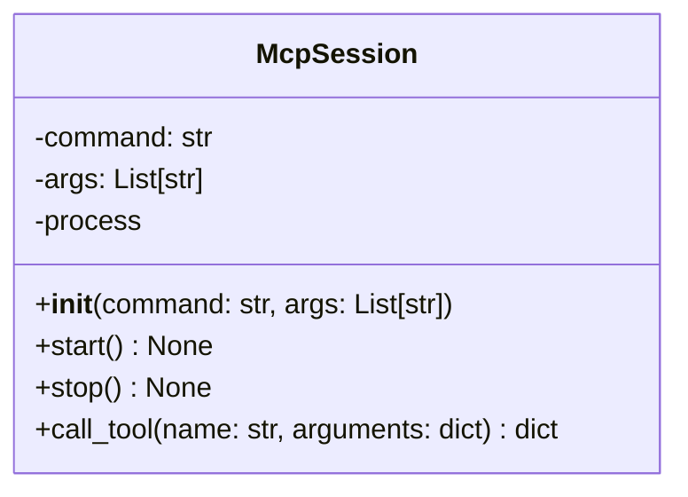

---

### 8.4 `mcp/arxiv_client.py`

**Purpose**

`ArxivMcpClient` is a **source-specific MCP client** that uses `McpSession`
internally, but exposes **semantically meaningful methods** for SummX:

* `search_papers(...)`
* `download_paper(...)`
* `read_paper(...)`

It translates between:

* SummX models (`PaperMeta`, `PaperContentSections`) and
* the raw MCP tool responses.

This allows the rest of the system (agent, UI, CLI) to stay completely MCP-agnostic.

**Key responsibilities**

* Build arXiv search queries from SummX `SearchPlan` / `SearchFilters`.
* Invoke MCP tools:

  * `search_papers`
  * `download_paper`
  * `read_paper`
* Map MCP responses into:

  * `PaperMeta`
  * `PaperContentSections`

**Suggested class**

#### `ArxivMcpClient`

**Fields (suggested)**

* `session: McpSession` – underlying MCP session
* (Optionally) `source_name: str = "arxiv"` – used for logging/metrics

**Methods (suggested)**

1. `search_papers(topic: str | None, author: str | None, sort: SortType, limit: int) -> list[PaperMeta]`

   * Build a search expression based on topic/author/sort.
   * Call `session.call_tool("search_papers", {...})`.
   * Translate response items to `PaperMeta`.

2. `download_paper(arxiv_id: str) -> str | None`

   * Call `session.call_tool("download_paper", {"arxiv_id": arxiv_id})`.
   * Return local file path if available.

3. `read_paper(arxiv_id: str) -> PaperContentSections`

   * Ensure paper is downloaded (may call `download_paper` first).
   * Call `session.call_tool("read_paper", {"arxiv_id": arxiv_id})`.
   * Map response into `PaperContentSections`.

4. `get_papers_for_plan(plan: SearchPlan) -> list[PaperMeta]` (optional convenience)

   * Take a `SearchPlan` from the agent.
   * Internally call `search_papers(...)` with extracted filters.

**UML – Arxiv MCP Client**

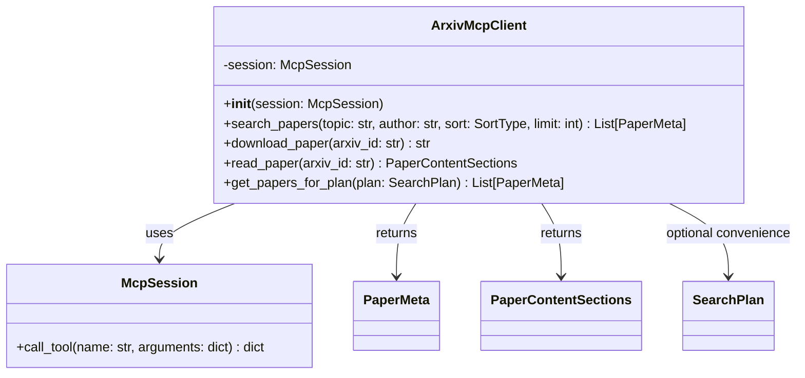

---

### 8.5 End-to-End Flow Through MCP Layer

**Typical data flow:**

1. **Agent** has a `SearchPlan`.
2. Agent (executor) calls:

   ```python
   papers = arxiv_client.search_papers(
       topic=plan.filters.topic,
       author=plan.filters.author,
       sort=plan.sort,
       limit=plan.limit,
   )
   ```
3. `ArxivMcpClient` builds a tool request and calls:

   ```python
   session.call_tool("search_papers", payload)
   ```
4. `McpSession`:

   * sends the request over MCP,
   * receives JSON,
   * returns it as a dict.
5. `ArxivMcpClient` maps each result to `PaperMeta`.
6. For each paper, agent may call:

   * `arxiv_client.download_paper(arxiv_id)`
   * `arxiv_client.read_paper(arxiv_id)` → `PaperContentSections`
7. Executor then sends sections to the summarizer LLM.

This isolates MCP complexities in one package and keeps the rest of SummX
working with clean, typed Python objects.

---

## 9. `src/summx/llm/` – LLM Abstraction Layer

The `llm` package provides a clean abstraction over different LLM providers
(OpenAI, Groq, etc.) so the rest of SummX only deals with a single interface:
**`LLMClient`**.

Goals:

- Keep provider-specific details isolated.
- Make it easy to plug in new backends (local models, Ollama, etc.).
- Allow different models for:
  - the **planner** (controller LLM), and
  - the **summarizer** (paper summary generator).

### 9.1 Structure

```text
src/summx/llm/
├── __init__.py
├── base.py
├── openai_client.py
└── groq_client.py
```

---

### 9.2 `llm/__init__.py`

**Purpose**

* Provide a simple import surface for LLM-related objects.
* Avoid having to import from deep provider-specific modules.

**Typical usage**

```python
from summx.llm import LLMClient, get_llm
```

**Responsibilities**

* Re-export:

  * `LLMClient` base class
  * `get_llm()` factory function

---

### 9.3 `llm/base.py`

**Purpose**

Define the **abstract base interface** for all LLM providers and a
**factory function** to construct concrete clients from config.

This is the file most other modules depend on.

#### 9.3.1 `LLMClient` (abstract base)

Represents the minimal interface SummX expects from any LLM backend.

**Methods (suggested)**

* `async def chat(self, messages: list[dict[str, str]]) -> str`
  where `messages` is a standard OpenAI-style chat list:

  ```python
  [
    {"role": "system", "content": "..." },
    {"role": "user", "content": "..." },
    ...
  ]
  ```

You can extend later with things like `sampling_params`, `json_mode`, etc.

#### 9.3.2 `get_llm()` (factory)

Given a provider name + config, return an appropriate `LLMClient`
implementation.

Example:

```python
client = get_llm(
    provider="openai",
    api_key="...",
    model="gpt-4.1-mini",
)
```

---

#### 9.3.3 UML – Base LLM Interface

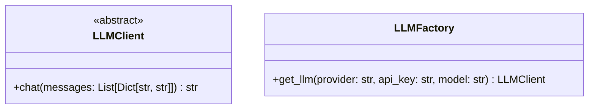

*(The factory can just be a function; the UML treats it as a conceptual component.)*

---

### 9.4 `llm/openai_client.py`

**Purpose**

Concrete implementation of `LLMClient` that talks to OpenAI’s API.

Used for:

* Query planning (controller LLM)
* Summarization (if you choose OpenAI as backend)

**Key responsibilities**

* Initialize OpenAI client from API key and model name.
* Implement `chat()` using `client.chat.completions.create(...)`.
* Map SummX’s generic messages format to OpenAI’s API.

**Suggested class**

#### `OpenAIClient`

**Fields (suggested)**

* `api_key: str`
* `model: str`
* `client` – underlying OpenAI client object

**Methods**

* `__init__(api_key: str, model: str)`
* `async chat(messages: list[dict[str, str]]) -> str`

---

#### 9.4.1 UML – OpenAI Client

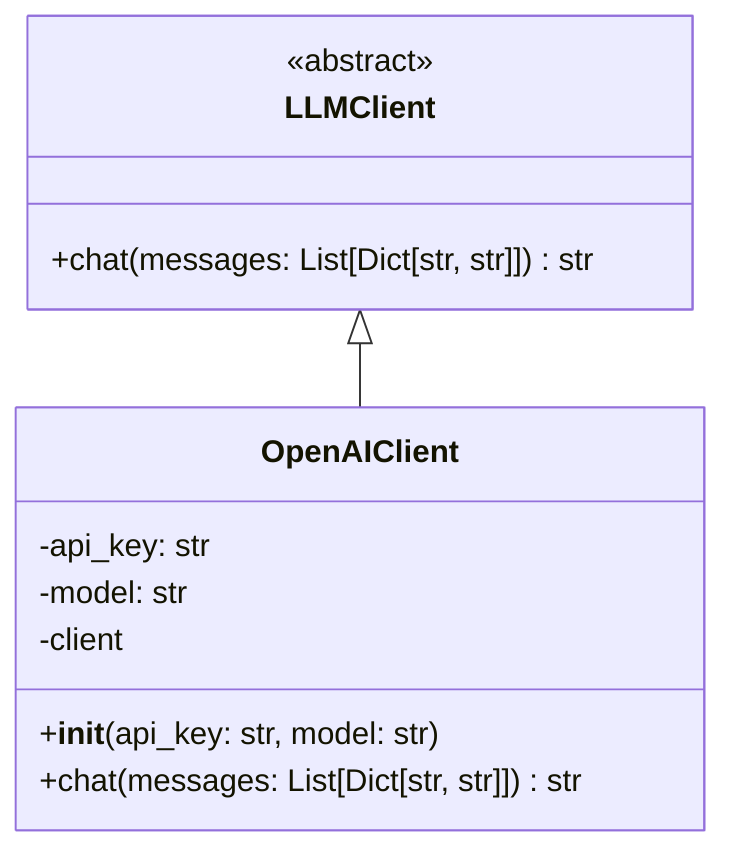

---

### 9.5 `llm/groq_client.py`

**Purpose**

Concrete implementation of `LLMClient` that talks to **GroqCloud**.

Used for:

* Summarization with fast/cheap open models (e.g., LLaMA, Mixtral variants).
* Potentially also as planner if you want to keep everything on Groq.

**Key responsibilities**

* Initialize Groq client with API key and model name.
* Implement `chat()` using Groq’s chat completion API.
* Provide the same behavior as `OpenAIClient` from the caller’s perspective.

**Suggested class**

#### `GroqClient`

**Fields (suggested)**

* `api_key: str`
* `model: str`
* `client` – Groq API client object

**Methods**

* `__init__(api_key: str, model: str)`
* `async chat(messages: list[dict[str, str]]) -> str`

---

#### 9.5.1 UML – Groq Client

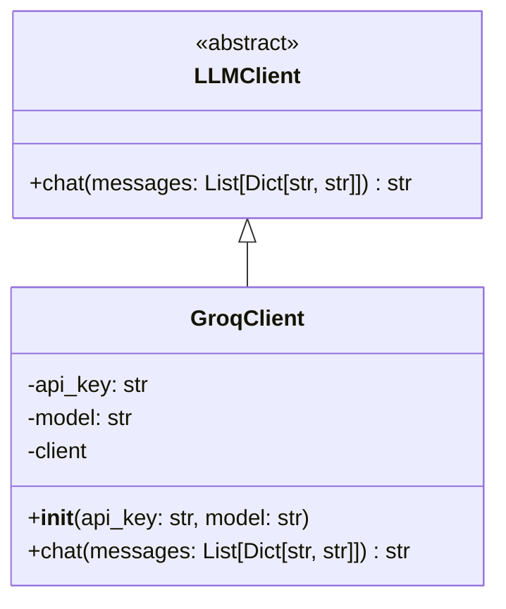

---

### 9.6 How the LLM Layer Is Used

The LLM abstraction gets plugged into two distinct roles:

1. **Planner LLM** (controller)

   * Used by `QueryPlanner` (in `agent/planner.py`)
   * Converts user natural-language query → `SearchPlan`

2. **Summarizer LLM**

   * Used by `PlanExecutor` (in `agent/executor.py`)
   * Converts paper text → `PaperSummary`

Both are created via `get_llm()` with different configs:

```python
planner_llm = get_llm(
    provider=config.planner_provider,
    api_key=config.planner_api_key,
    model=config.planner_model,
)

summarizer_llm = get_llm(
    provider=config.summarizer_provider,
    api_key=config.summarizer_api_key,
    model=config.summarizer_model,
)
```

Because the rest of the code only talks to `LLMClient`, you can switch
providers (or models) without changing the agent, MCP layer, CLI, or UI.

---

## 10. `src/summx/agent/` – Agent Logic

The `agent` package is the **core orchestration layer** of SummX.

Its job:

> Take a vague natural-language query → turn it into a structured plan → execute that plan via MCP and LLMs → return structured results (`PaperResult`).

It is intentionally split into:

- **`QueryPlanner`** – “What should we do?”
- **`PlanExecutor`** – “Now do it.”
- **`PaperAgent`** – A façade that glues planner and executor together for UI/CLI.

### 10.1 Structure

```text
src/summx/agent/
├── __init__.py
├── planner.py
└── executor.py
```

---

### 10.2 `agent/__init__.py`

**Purpose**

* Provide a clean, single entry point for the rest of the app to use the agent.
* Avoid long import paths.

**Typical usage**

```python
from summx.agent import PaperAgent
```

**Responsibilities**

* Re-export:

  * `PaperAgent` (from `executor.py`)
  * `QueryPlanner` (from `planner.py`) if needed externally.

No logic is implemented here.

---

### 10.3 `agent/planner.py`

**Purpose**

Convert a **natural-language user query** into a structured **`SearchPlan`** using an LLM.

This is the **controller** in the ReAct-style sense:
it interprets user intent and produces a machine-executable plan object.

**Key responsibilities**

* Accept raw user query strings
* Use the planner LLM (`LLMClient`) with a prompt from `prompts.py`
* Emit a `SearchPlan` (from `models.plan`) that the executor can trust

**Primary class**

#### `QueryPlanner`

**Fields (suggested)**

* `llm: LLMClient` – the planner/controller LLM
* (Optionally) `system_prompt: str` – to allow easy prompt swapping

**Methods (suggested)**

* `async plan(raw_query: str) -> SearchPlan`

  * Build messages using `prompts.QUERY_PLANNER_SYSTEM`
  * Call `llm.chat(messages)`
  * Parse JSON into a `SearchPlan` instance
  * Attach `raw_query` into the plan for traceability

**Simplified flow**

```python
raw_query --> QueryPlanner.plan() --> SearchPlan
```

---

#### 10.3.1 UML – Planner

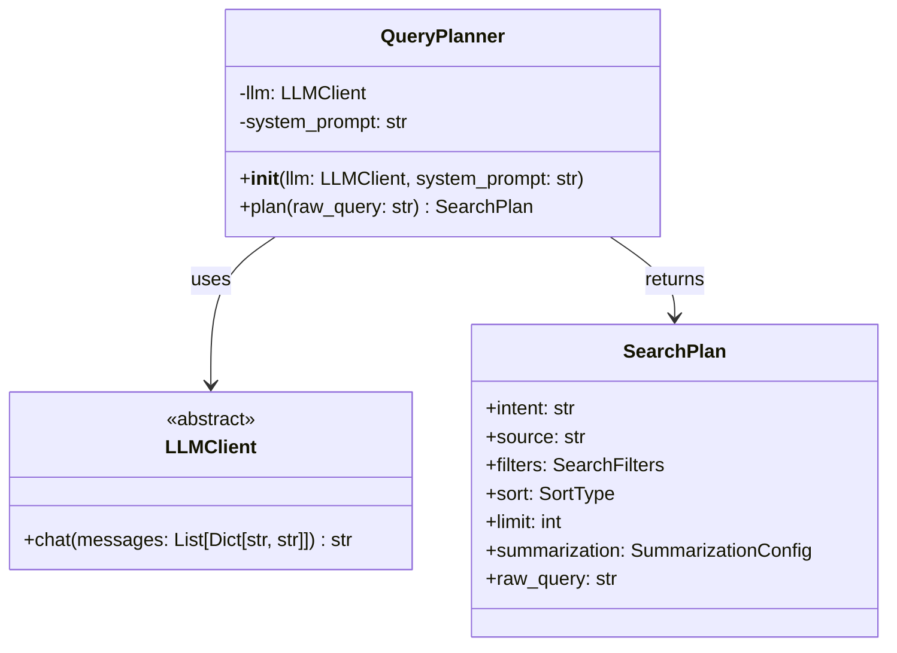

---

### 10.4 `agent/executor.py`

**Purpose**

Take a **`SearchPlan`** and actually **do the work**:

1. Use `ArxivMcpClient` to:

   * search for papers,
   * download them,
   * read/extract text.
2. Use the summarizer LLM to:

   * process paper content into `PaperSummary` objects.
3. Return a list of `PaperResult` objects for the UI/CLI.

This is where the “agent” becomes operational.

There are two main roles here:

* **`PlanExecutor`** – low-level execution engine
* **`PaperAgent`** – high-level façade for UI/CLI

---

#### 10.4.1 `PlanExecutor`

**Responsibilities**

* Execute `SearchPlan` → `list[PaperResult]`
* Fetch papers via MCP
* Summarize content via LLM

**Fields (suggested)**

* `mcp_client: ArxivMcpClient`
* `summarizer_llm: LLMClient`

**Methods (suggested)**

* `async execute(plan: SearchPlan) -> list[PaperResult]`

  * Call `mcp_client.search_papers(...)` using `plan.filters`, `plan.sort`, `plan.limit`
  * For each `PaperMeta`:

    * If `plan.summarization.enabled`:

      * Call `mcp_client.read_paper(meta.arxiv_id)` → `PaperContentSections`
      * Build summarization prompt (from `prompts.py`)
      * Call `summarizer_llm.chat(...)` → parse into `PaperSummary`
      * Wrap into `PaperResult(meta, content, summary)`
    * Else:

      * Create `PaperResult` with `summary=None`, maybe `content=None`
  * Return list of `PaperResult`

---

#### 10.4.2 `PaperAgent`

**Purpose**

Provide a **simple API** for the rest of the app (CLI/UI):

> “Here’s a user query string, give me back the results.”

It internally orchestrates:

1. `QueryPlanner` (to get a `SearchPlan`)
2. `PlanExecutor` (to execute that `SearchPlan`)

**Fields (suggested)**

* `planner: QueryPlanner`
* `executor: PlanExecutor`

**Methods (suggested)**

* `async run(raw_query: str) -> tuple[SearchPlan, list[PaperResult]]`

  * `plan = await planner.plan(raw_query)`
  * `results = await executor.execute(plan)`
  * return `(plan, results)`

This keeps the interface used by UI and CLI very simple.

---

#### 10.4.3 UML – Executor + Agent

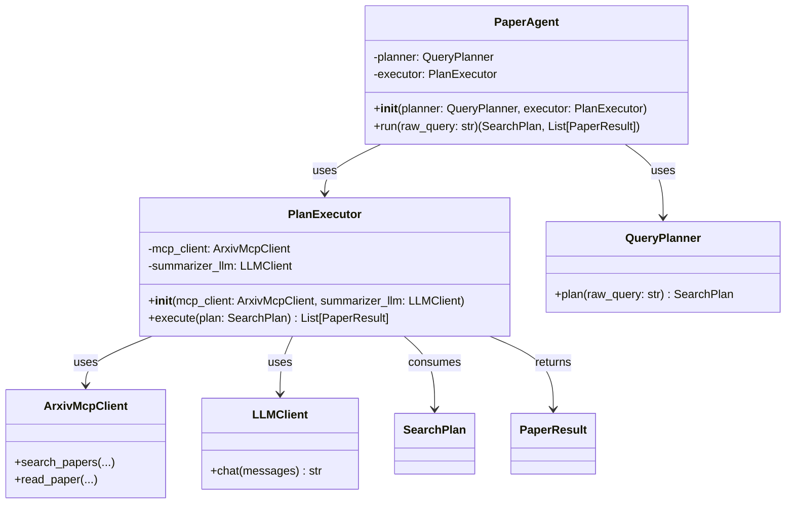

---

### 10.5 End-to-End Agent Flow

Putting it all together:

1. **CLI/UI** calls:

   ```python
   plan, results = await paper_agent.run(user_query)
   ```

2. **PaperAgent.run**:

   * `plan = await planner.plan(user_query)`
   * `results = await executor.execute(plan)`

3. **QueryPlanner.plan**:

   * LLM → `SearchPlan` (topic, author, sort, limit, summarization)

4. **PlanExecutor.execute**:

   * MCP → `PaperMeta` + `PaperContentSections`
   * Summarizer LLM → `PaperSummary`
   * Build `PaperResult` list

5. **CLI/UI** renders:

   * Plan info (e.g. “most recent 5 hypergraph papers”)
   * For each `PaperResult`:

     * Title, authors, date, categories
     * Download links
     * Summary sections

This separation keeps the agent logic testable and composable:
you can unit-test planner and executor independently, and integration-test `PaperAgent` end-to-end.

---

## 11. `src/summx/cli/` – Command Line Interface

The `cli` package provides the **`summx` command** that users run in a shell.

Goals:

- Offer a simple, scriptable interface for researchers.
- Be a **thin** layer over `PaperAgent` and config.
- Support both:
  - one-off queries (for scripts, terminals),
  - launching the web UI.

### 11.1 Structure

```text
src/summx/cli/
├── __init__.py
└── main.py
```

---

### 11.2 `cli/__init__.py`

**Purpose**

* Make it easy to import the CLI app if needed from Python (e.g., for testing).
* Provide a single symbol exposed as the entrypoint in `pyproject.toml`.

**Typical usage**

```python
from summx.cli import app
```

Where `app` is the Typer (or Click) application object defined in `main.py`.

**Responsibilities**

* Re-export `app` from `main.py`.

No command logic is defined here.

---

### 11.3 `cli/main.py`

**Purpose**

Define the **CLI entrypoint** for the `summx` command.

This file:

1. Constructs core components (config, MCP client, LLM clients, `PaperAgent`).
2. Defines CLI commands (via Typer or Click).
3. Bridges user input → `PaperAgent.run()` → terminal output.
4. Optionally launches the Streamlit UI.

With Typer, `main.py` will typically expose a top-level `app`:

```python
import typer

app = typer.Typer()
```

which is referenced by:

```toml
[project.scripts]
summx = "summx.cli.main:app"
```

---

### 11.3.1 CLI Commands (suggested)

At minimum:

1. `summx query "some natural language query"`

   * The most general entrypoint.
   * Directly feeds the given string to `PaperAgent.run`.

2. `summx ui`

   * Launches the Streamlit UI.
   * Typically runs: `streamlit run summx/ui/streamlit_app.py`.

You can add more opinionated commands later, e.g.:

* `summx author "Author Name" --limit 1`
* `summx id 2403.12345`

These can still internally build a natural-language query (or a manual `SearchPlan`) and pipe it into the same agent.

---

### 11.3.2 Suggested CLI Shape

Conceptual behavior for main commands:

#### `summx query`

```bash
summx query "five most recent papers on hyper graphs"
```

* Load config (API keys, models, MCP settings).
* Instantiate:

  * planner LLM
  * summarizer LLM
  * MCP session + `ArxivMcpClient`
  * `QueryPlanner`, `PlanExecutor`, `PaperAgent`
* Call:

  ```python
  plan, results = await agent.run(query)
  ```
* Print:

  * Plan summary (what the agent understood)
  * A list of papers with titles, authors, dates
  * Optionally, summaries in text form
  * Download URLs

#### `summx ui`

```bash
summx ui
```

* Load config as needed.
* Run:

  ```bash
  streamlit run summx/ui/streamlit_app.py
  ```

  (or equivalent Python call using `subprocess.run`.)

---

### 11.3.3 UML – CLI Layer

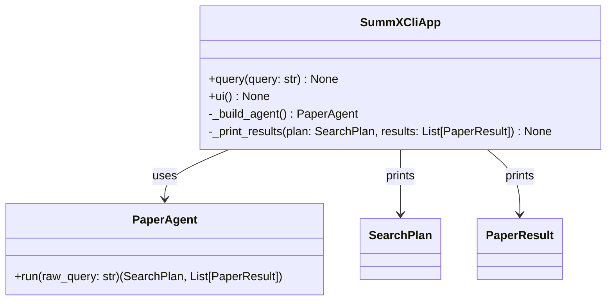

> In code, `SummXCliApp` is conceptually represented by the Typer `app`
> and the functions registered as commands. You don’t strictly need a
> `SummXCliApp` class, but the UML shows the logical responsibilities.

---

### 11.3.4 Example Flow for `summx query`

1. **User** runs:

   ```bash
   summx query "most recent publication by Laszlo Lovasz"
   ```

2. **CLI** `query` command:

   * Validates arguments.
   * Calls `_build_agent()` to construct a `PaperAgent`.

3. **PaperAgent**:

   * `planner.plan(raw_query)` → `SearchPlan`.
   * `executor.execute(plan)` → `List[PaperResult]`.

4. **CLI**:

   * Calls `_print_results(plan, results)`:

     * Prints interpreted plan:

       * source = arxiv
       * filters.author = "Laszlo Lovasz"
       * sort = most_recent
       * limit = 1
     * For each `PaperResult`:

       * prints title, authors, date, categories
       * prints summary (unless suppressed by flags)
       * prints PDF URL

This design keeps the CLI **very thin** and pushes all real logic into
the agent, LLM, and MCP layers, which is exactly what we want for
testability and reuse.

---

## 12. `src/summx/ui/` – Streamlit Web UI

The `ui` package provides a **lightweight web interface** for SummX using Streamlit.

Goals:

- Make SummX accessible to researchers who prefer a GUI over CLI.
- Expose the same agent capabilities as the CLI, but with:
  - a text box for queries,
  - dropdowns for model/provider selection,
  - nicely formatted paper cards and summaries,
  - download links for PDFs.

### 12.1 Structure

```text
src/summx/ui/
├── __init__.py
└── streamlit_app.py
```

---

### 12.2 `ui/__init__.py`

**Purpose**

* Keep the package importable and optionally expose UI helpers.

**Typical usage**

Normally, the CLI will launch the UI via `streamlit run`, so this file may remain minimal.

Optionally, it could expose a helper:

```python
from summx.ui import launch_ui
```

but this is not strictly necessary.

**Responsibilities**

* Mark this directory as a Python package.
* (Optional) expose `launch_ui()` wrapping the Streamlit script.

---

### 12.3 `ui/streamlit_app.py`

**Purpose**

Defines the **Streamlit application** that:

1. Collects user input (query, providers, models, depth).
2. Builds the `PaperAgent` with the chosen configuration.
3. Calls `PaperAgent.run(query)` asynchronously.
4. Renders results as a list of cards:

   * Paper metadata (title, authors, date, categories)
   * Download links (arXiv PDF URL and/or local cached PDF)
   * Summaries in Markdown

This is what gets executed when the user runs:

```bash
summx ui
```

or manually:

```bash
streamlit run src/summx/ui/streamlit_app.py
```

---

### 12.3.1 Page Layout (suggested)

A simple layout might look like:

* **Sidebar**

  * Planner provider + model (e.g. OpenAI model)
  * Summarizer provider + model (OpenAI or Groq)
  * Summarization depth (`abstract`, `abstract+intro+conclusion`, `full`)
  * Max papers / limit
  * API key boxes (or rely on environment / config)

* **Main area**

  * Title: "SummX – arXiv Paper Agent"
  * Text input for natural-language query
  * "Run agent" button
  * Results:

    * For each paper:

      * Title (as header)
      * Authors, date, categories
      * Download buttons / links
      * Collapsible or inline summary markdown

---

### 12.3.2 Responsibilities of `streamlit_app.py`

* Initialize Streamlit page config (title, layout).
* Read or request configuration values (API keys, model names).
* On button click:

  1. Instantiate planner and summarizer LLMs (via `get_llm()`).
  2. Instantiate MCP session and `ArxivMcpClient`.
  3. Construct `QueryPlanner`, `PlanExecutor`, and `PaperAgent`.
  4. Run `PaperAgent.run(user_query)` inside an async context.
  5. Render the returned `SearchPlan` and `List[PaperResult]`.

**Note:** The underlying logic must not live in the UI; it should be delegated
to the agent and core layers.

---

### 12.3.3 UML – UI Layer

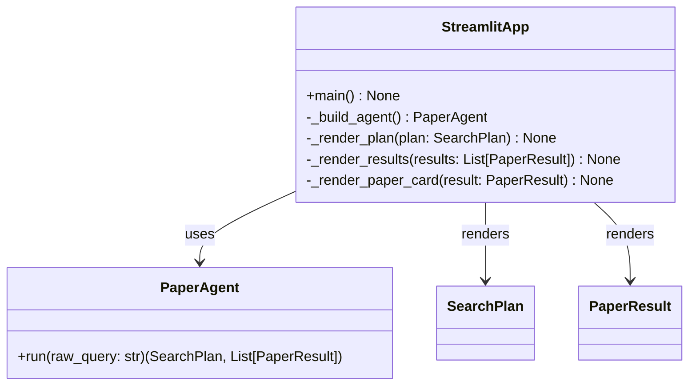

> In code, `StreamlitApp` is represented by the functions in `streamlit_app.py`
> (e.g. `main()`, `_build_agent()`, `_render_paper_card()`), but the UML shows
> the logical responsibilities and dependencies.

---

### 12.3.4 Example UI Flow

1. **User** opens the UI:

   ```bash
   summx ui
   ```

2. **Streamlit** renders:

   * Sidebar configuration controls
   * Query input box
   * "Run agent" button

3. **User** enters:

   > "show me the five most recent papers published to arXiv that deal with hyper graphs"

4. **On button click**:

   * `StreamlitApp._build_agent()`:

     * Reads sidebar options / config
     * Creates planner LLM, summarizer LLM
     * Creates `McpSession`, `ArxivMcpClient`
     * Instantiates `QueryPlanner`, `PlanExecutor`, `PaperAgent`
   * Calls:

     ```python
     plan, results = await agent.run(user_query)
     ```

5. **Rendering**:

   * `_render_plan(plan)`:

     * Shows how the agent interpreted the query:

       * filters.topic = "hyper graphs"
       * sort = "most_recent"
       * limit = 5
       * summarization.depth = "abstract+intro+conclusion"
   * `_render_results(results)`:

     * For each `PaperResult`:

       * `_render_paper_card(result)`:

         * Title, authors, date, categories
         * `[Download PDF]` link to arXiv or a local `download_button`
         * Summary Markdown

This provides a rich but simple way for non-CLI users to explore SummX,
while the CLI remains the best choice for scripting and automation.

---

## 13. MCP Backend Choice: Emi’s Arxiv-MCP Server

For SummX, we have chosen to base our arXiv integration on the open-source
**Arxiv-MCP server by Emi (emi-dm)**.

This server will be **forked and installed locally**, and run via `uv`,
rather than used as an external hosted service. This aligns with SummX’s
local-first, researcher-controlled philosophy.

---

### 13.1 Why We Chose Emi’s Server

We evaluated multiple MCP-based arXiv servers and selected **Emi’s Arxiv-MCP**
for the following reasons:

1. **Designed explicitly for MCP**  
   It exposes a clean MCP tool interface (not just a raw API wrapper), making
   it ideal for agent-based systems like SummX.

2. **Can be forked and self-hosted easily**  
   We can fork it, modify it, and run it locally using `uv`, which means:
   - No dependency on third-party uptime
   - Full control over behavior, defaults, and extensions
   - Easier long-term maintenance

3. **Already provides the right tool surface**
   Tools such as:
   - `search_papers`
   - `search_by_author`
   - `get_paper_details`
   - `download_paper_pdf`
   align very well with SummX’s architecture.

4. **Good baseline + easy to generalize**
   Although its README focuses on software engineering research (`cs.SE`),
   its implementation supports arbitrary arXiv categories and can be easily
   generalized in our fork.

---

### 13.2 Important Limitations & Design Considerations

Although Emi’s server is a strong foundation, there are a few things SummX
explicitly accounts for in its MCP abstraction layer.

#### 1. Default Category Bias (`cs.SE`)

By default, Emi’s `search_papers` tool is oriented toward the  
**Software Engineering** category (`cs.SE`).

However, SummX is designed to be **domain-agnostic**:

- In our fork, we will:
  - remove or relax the hard default to `cs.SE`, and
  - allow `category=None` or multi-category queries.
- In SummX’s `ArxivMcpClient`, we will:
  - always pass an explicit `category` (even if `None`),
  - optionally map topics → likely arXiv categories in the agent/planner.

This ensures SummX works equally well for:
- hypergraphs (`math.CO`, `math.GR`, `cs.DS`)
- physics
- AI/ML
- or any other arXiv domain.

---

#### 2. MCP Tool Interface Mapping

SummX does **not** rely directly on Emi’s tool interface.

Instead, it enforces a clean internal abstraction:

```text
Arxiv-MCP Server  --->  McpSession  --->  ArxivMcpClient  --->  SummX Agent
```

This means:

- If Emi changes tool signatures, we only update `ArxivMcpClient`.
- If we swap MCP servers in the future, the rest of SummX remains unchanged.
- Our agent never talks to raw MCP tools — only to typed Python methods.

---

#### 3. Tool Naming vs SummX Semantics

Emi’s server has opinionated tool names like:

- `search_papers`
- `search_by_author`
- `analyze_paper_trends`
- `find_related_papers`

SummX does **not** expose these names to users or LLM prompts directly.
Instead:

| Emi Tool | SummX Equivalent |
|----------|------------------|
| `search_papers` | `ArxivMcpClient.search_papers()` |
| `search_by_author` | `ArxivMcpClient.search_by_author()` |
| `download_paper_pdf` | `ArxivMcpClient.download_paper()` |
| `get_paper_details` | `ArxivMcpClient.read_paper()` |

This keeps SummX decoupled from tool branding / naming conventions and
lets us refactor or normalize behavior over time.

---

#### 4. arXiv API Limitations Still Apply

Because Emi’s server ultimately uses the official **arXiv API**, SummX inherits:

- arXiv’s query syntax constraints,
- result paging limits,
- rate limit behavior,
- metadata-first search (abstract/metadata, not semantic full-text search).

We treat these as inherent limitations of arXiv itself, not of the MCP layer.

Where needed, SummX may:
- introduce result paging support,
- cache responses,
- or supplement with local embeddings / RAG later.

---

### 13.3 How This Affects SummX’s MCP Layer

As a direct result of choosing Emi’s Arxiv-MCP, our MCP layer (`src/summx/mcp/`) must:

1. Allow injection of:
   - custom command paths (to our forked server),
   - custom tool naming if changed.

2. Always explicitly pass categories to avoid hidden `cs.SE` bias.

3. Perform mapping from:
   Emi MCP tool responses → SummX domain models.

4. Treat the MCP server as:
   - an external, replaceable dependency,
   - never as part of core business logic.

---

### 13.4 Summary

By choosing Emi’s Arxiv-MCP server **as a forked, local dependency**, SummX:

✅ Gains a robust MCP-compliant arXiv backend  
✅ Avoids deep coupling to a single implementation  
✅ Can generalize beyond software engineering easily  
✅ Stays flexible for future MCP tool replacements  

This choice supports SummX’s long-term goal:
> a local, agentic, domain-agnostic research assistant for arXiv and beyond.

---