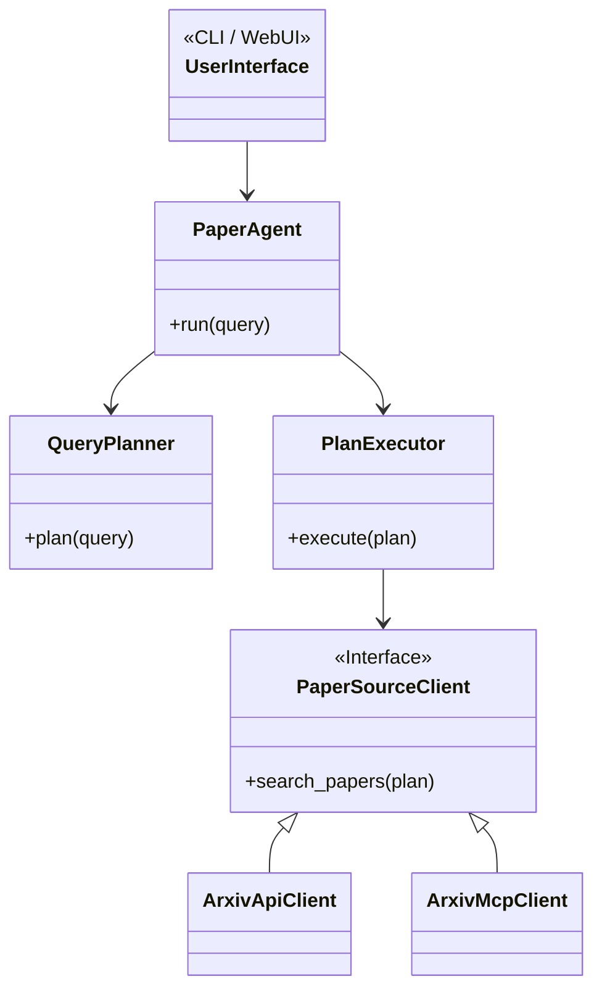

---
js:
  - https://cdn.jsdelivr.net/npm/mermaid/dist/mermaid.min.js
---

# SummX

**SummX** is a local, agent-based AI tool designed to search, retrieve, and summarize academic papers from online sources like arXiv.

It uses a multi-step, agentic pipeline to convert natural language queries into structured, summarized research findings.

## Core Features

-   **Natural Language Queries**: Ask for papers in plain English (e.g., "most recent papers on hypergraphs").
-   **Agentic Pipeline**: A `QueryPlanner` converts your request into a structured `SearchPlan`, which a `PlanExecutor` then executes.
-   **Pluggable Backends**:
    -   **LLM Providers**: Supports multiple LLM backends (OpenAI, Groq) for planning and summarization.
    -   **Paper Sources**: A `PaperSourceClient` interface allows for multiple paper backends. The primary backend is a direct client for the arXiv API. An experimental MCP-based client is also included.
-   **CLI & Web UI**: Interact with SummX through a command-line interface or a Streamlit-based web UI.
-   **Local-First**: Designed for local execution and caching of results.

## Architecture

SummX follows a modular, API-first design. The core agent logic is decoupled from the data sources, allowing for greater stability and extensibility.

This architecture ensures that the core functionality does not depend on the availability of any single external service (like an MCP server) and can be easily extended to support new paper sources in the future.

