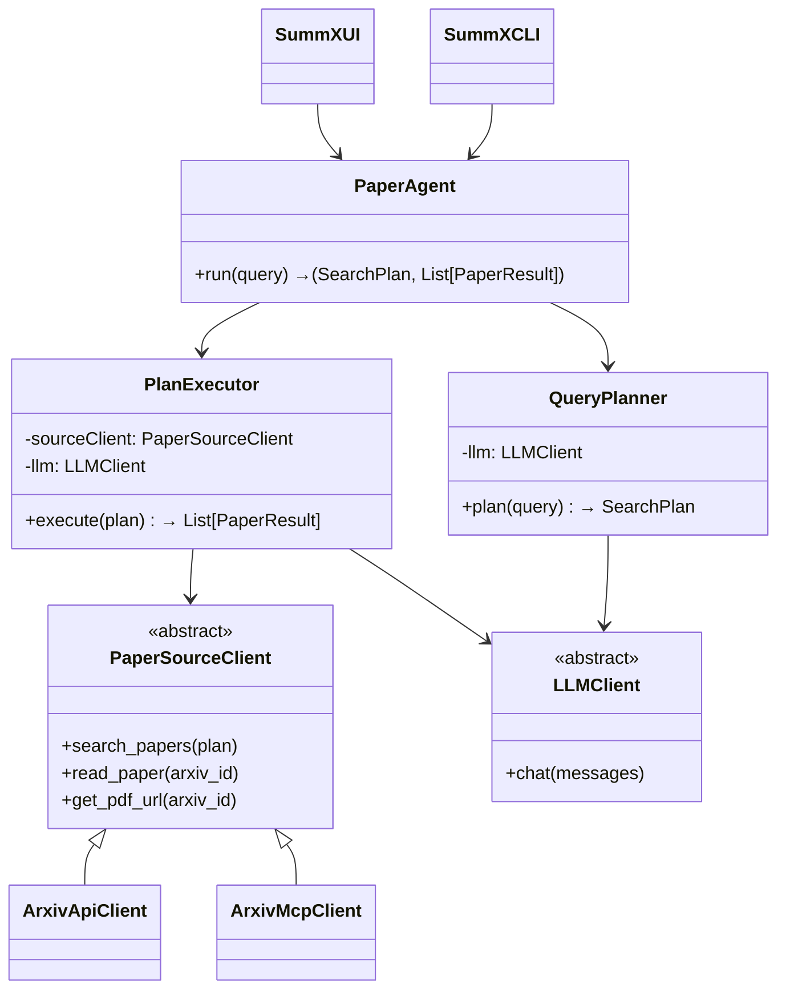
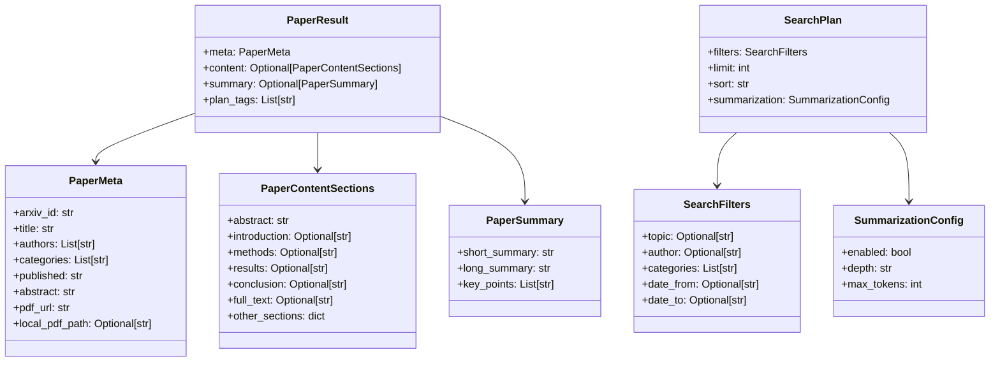
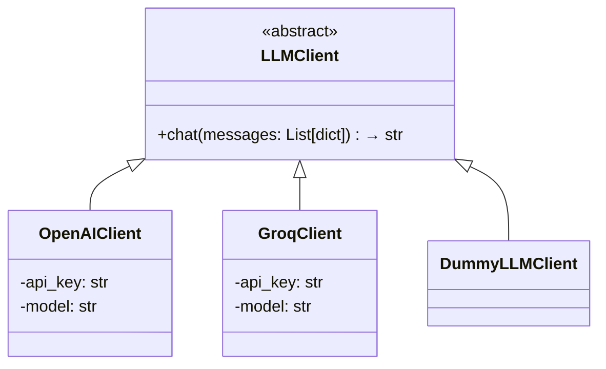
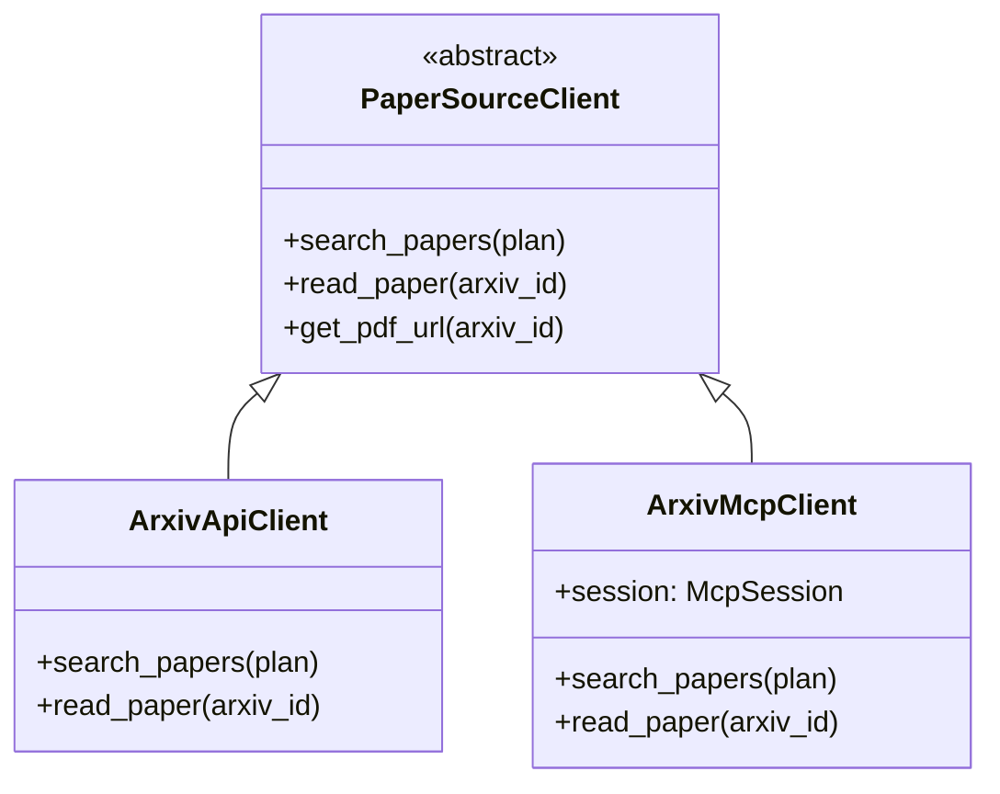
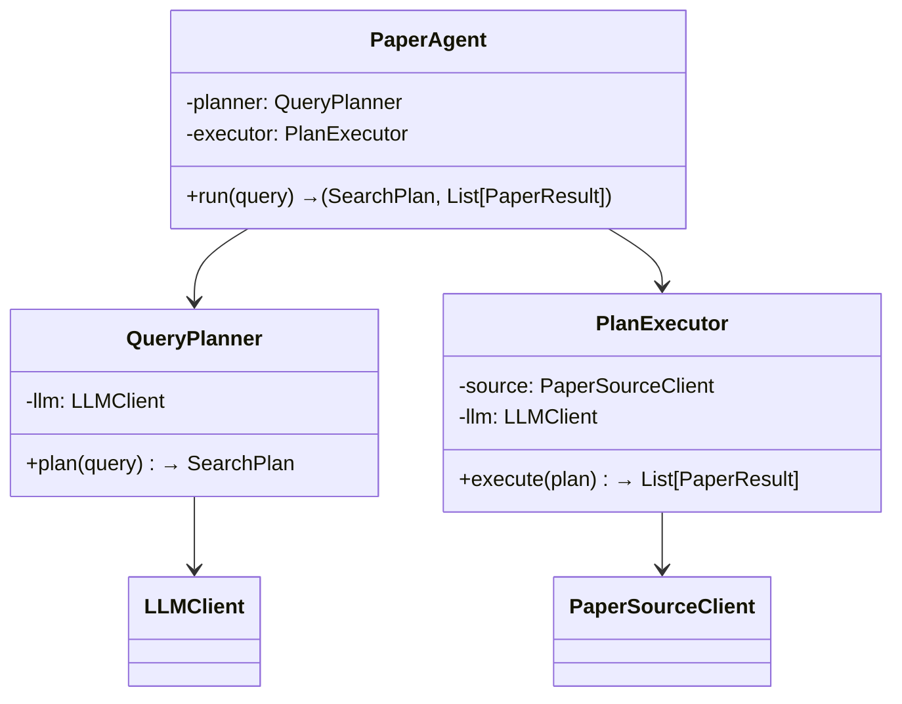
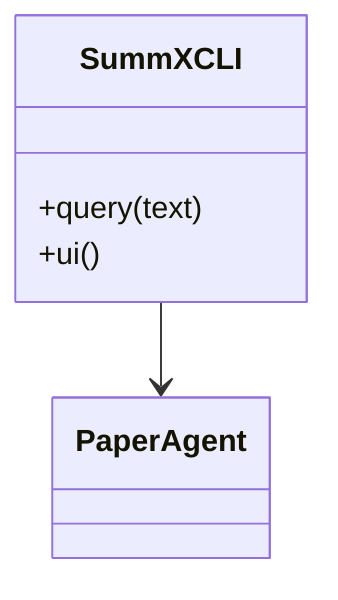
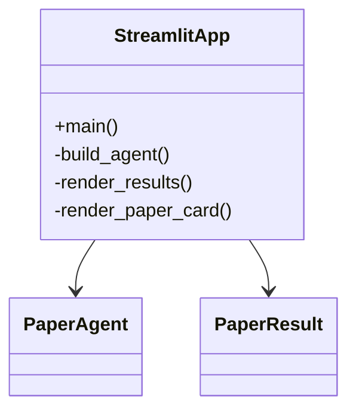
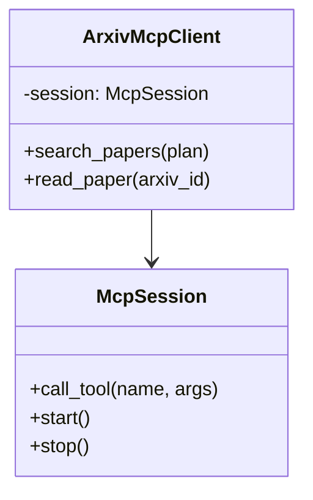

---
js:
  - https://cdn.jsdelivr.net/npm/mermaid/dist/mermaid.min.js
---

This file - **`structure.md`** -focuses purely on **architecture, structure, and UML** instead of installation/marketing.

This reflects the **API-first design, MCP as optional**, and the complete module layout with class diagrams.

---

# SummX — Architecture & Structure

This document describes the **internal architecture, module structure, and class design**
for SummX.

Unlike a user README, this file is meant for **developers and contributors** who want to
understand, extend, or re-implement parts of the system.

---

## 1. High-Level Architecture

SummX is an **agentic research assistant** built around the following pipeline:

```text
User Query
↓
QueryPlanner (LLM)
↓
SearchPlan
↓
PaperAgent
↓
PlanExecutor
↓
PaperSourceClient  ───────────→ arXiv
↓                          (via API or MCP)
Results + Summaries
↓
CLI / UI
```

The system is layered to allow **backend swapping** and **LLM/provider abstraction**.

---

## 2. Key Design Principle

The most important design decision:

> The agent does **not** depend directly on MCP or the arXiv API.
> It only depends on a generic `PaperSourceClient` interface.

This means:

- Current production backend: ✅ `ArxivApiClient`
- Optional future backend: `ArxivMcpClient` (using a forked MCP server)

---

## 3. Global UML Overview



---

## 4. Module & Directory Structure

```text
src/summx/
├── __init__.py
├── config.py
├── prompts.py
│
├── models/
│   ├── __init__.py
│   ├── paper.py
│   └── plan.py
│
├── llm/
│   ├── __init__.py
│   ├── base.py
│   ├── openai_client.py
│   └── groq_client.py
│
├── sources/
│   ├── __init__.py
│   ├── base.py
│   └── arxiv_api_client.py
│
├── agent/
│   ├── __init__.py
│   ├── planner.py
│   ├── executor.py
│   └── agent.py
│
├── cli/
│   ├── __init__.py
│   └── main.py
│
├── ui/
│   ├── __init__.py
│   └── streamlit_app.py
│
└── mcp/              (optional / experimental)
    ├── __init__.py
    ├── session.py
    └── arxiv_mcp_client.py
```

---

## 5. Models Layer (`models/`)

### Purpose

Defines all domain objects used throughout the system.

### UML



---

## 6. LLM Layer (`llm/`)

### Purpose

Abstracts away provider differences between OpenAI, Groq, etc.

### UML



---

## 7. Source Layer (`sources/`)

### Purpose

Provides a backend-independent abstraction over paper sources.

### Structure

```text
sources/
├── base.py             # PaperSourceClient
└── arxiv_api_client.py # ArxivApiClient (primary backend)
```

### UML



---

## 8. Agent Layer (`agent/`)

### Purpose

Encapsulates the agentic reasoning flow.

### UML



---

## 9. CLI Layer (`cli/`)

Implemented using Typer.

Responsibilities:

* Parse user input.
* Construct core objects.
* Run the agent.
* Render summaries & metadata to terminal.

### UML



---

## 10. UI Layer (`ui/`)

Implemented using Streamlit.

Responsibilities:

* Input box for user queries.
* Display structured paper cards.
* Provide PDF download links.

### UML



---

## 11. Optional MCP Layer (`mcp/`)

This layer is **not currently required** and is considered experimental.

It exists to allow SummX to talk to a forked MCP arXiv server.

### UML



---

## 12. Final Architectural Summary

* The **agent/core logic is complete and MCP-independent**.
* MCP exists as a **replaceable backend**, not a blocking dependency.
* The system is:

  * Modular
  * Testable
  * Pluggable
  * Designed for long-term research workflows.

This architecture supports:

* Adding more sources (e.g. PubMed, semantic scholar).
* Adding more LLM providers.
* Introducing multi-agent research later.

---

## End

This file intentionally avoids installation, usage, or marketing —
those belong in a separate `README.md`.

This file exists only to define how SummX is structured, how modules
interact, and how it should evolve.

